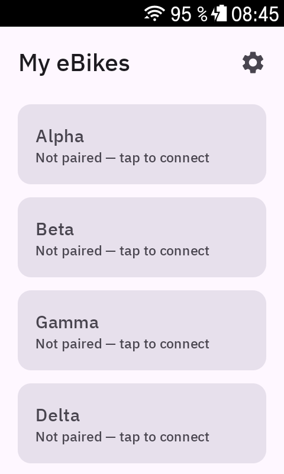
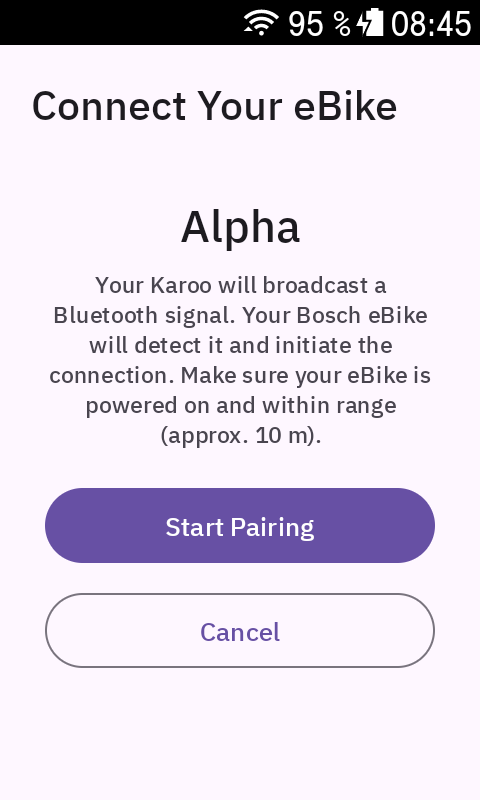
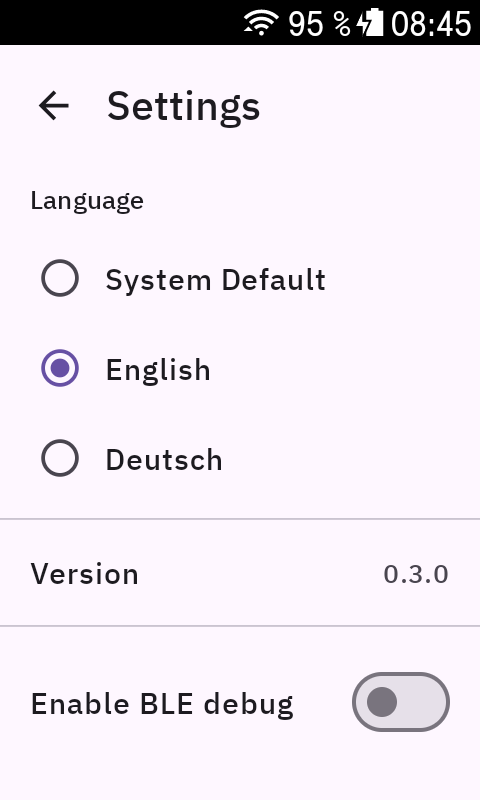

# Bosch LiveDataInterface for Karoo

[](https://github.com/julianhaas386-oss/Bosch-LiveDataInterface-for-Karoo/actions/workflows/build.yml)
[](LICENSE)
[](https://www.hammerhead.io/)
[](https://github.com/julianhaas386-oss/Bosch-LiveDataInterface-for-Karoo/releases/latest)

Streams live data from a Bosch Smart System eBike directly to your Hammerhead Karoo 2 or 3 via Bluetooth Low Energy.

## Screenshots

| eBike list | Pairing | Settings |
|:---:|:---:|:---:|
|  |  |  |

## Features

- **13 live eBike data fields** — sourced directly from the Bosch Live Data Interface (LDI)
- **eBike dashboard page** — dedicated Karoo page with battery, power, cadence, speed and odometer
- **BLE connection status field** — shows CONNECTED / SEARCHING / DISCONNECTED in any layout
- **Automatic reconnect** — re-advertises and reconnects after link loss without any interaction
- **Secure pairing** — one-time Bluetooth bonding; subsequent rides connect automatically

## Data Fields

| Field | Type ID | Unit | Description |
|-------|---------|------|-------------|
| Speed | `bosch_ldi_speed` | km/h or mph | Speed from the eBike drive unit |
| Cadence | `bosch_ldi_cadence` | rpm | Rider cadence |
| Rider Power | `bosch_ldi_rider_power` | W | Rider-only power (no motor contribution) |
| Battery | `bosch_ldi_battery_soc` | % | Battery state of charge (0–100) |
| Odometer | `bosch_ldi_odometer` | km / mi | Total eBike distance |
| Time | `bosch_ldi_time` | HH:MM | UTC time from the eBike system |
| Light | `bosch_ldi_bike_light` | ON / OFF | Bike light state |
| Brightness | `bosch_ldi_ambient_brightness` | lux | Ambient brightness from the eBike sensor |
| Light Reserve | `bosch_ldi_light_reserve_state` | — | Light reserve mode active |
| System Locked | `bosch_ldi_system_locked` | — | eBike locked |
| Charger | `bosch_ldi_charger_connected` | — | Charger connected |
| Diagnosis | `bosch_ldi_diagnosis_program_active` | — | Dealer diagnosis tool active |
| Standstill | `bosch_ldi_bike_not_driving` | — | Bike not moving |
| Connection | `bosch_ldi_connection` | text | BLE connection status |

### Dashboard Page

`bosch_ldi_ebike_dashboard` — a full Karoo page with battery SOC, rider power, cadence, speed and odometer displayed together. Add it via **Add Page → Extensions** in the Karoo ride profile editor.

## Installation

### Download APK

1. Download `bosch-ldi-vX.Y.Z.apk` from the [latest release](https://github.com/julianhaas386-oss/Bosch-LiveDataInterface-for-Karoo/releases/latest)
2. Enable USB debugging on the Karoo: **Settings → Developer Options → USB Debugging**
3. Connect the Karoo to your computer via USB and install:

```bash
adb install bosch-ldi-vX.Y.Z.apk
```

The extension registers automatically with the Karoo OS after installation. No reboot required.

### Alternative: Hammerhead Companion App

Transfer the APK to your Android phone and open it — the Companion app offers to install extensions directly to a paired Karoo.

### First Use — Pairing

After installation, open the **Bosch LiveDataInterface** app on the Karoo and follow the pairing wizard to bond with your eBike. Once paired, the extension connects automatically every time you turn on the eBike.

## Build from Source

**Prerequisites:** JDK 17, Android SDK (API 35), a GitHub Personal Access Token with `read:packages` scope (needed for `io.hammerhead:karoo-ext`)

```bash
git clone https://github.com/julianhaas386-oss/Bosch-LiveDataInterface-for-Karoo.git
cd Bosch-LiveDataInterface-for-Karoo
```

Add your GitHub credentials to `~/.gradle/gradle.properties` (do **not** commit these):

```properties
gpr.user=YOUR_GITHUB_USERNAME
gpr.key=YOUR_GITHUB_PAT_WITH_READ_PACKAGES_SCOPE
```

Build and install:

```bash
./gradlew assembleDebug
adb install app/build/outputs/apk/debug/app-debug.apk
```

### CI — GitHub Actions

Automated builds run on every push to `main` and every pull request. The debug APK is attached as an artifact for 7 days. To trigger a build manually: **Actions → Build & Release → Run workflow**.

To create a numbered release, push a version tag:

```bash
git tag v1.0.0
git push origin v1.0.0
```

This triggers the release job: builds the APK, creates a GitHub Release, and attaches `bosch-ldi-v1.0.0.apk`.

**Required repository secrets:**

| Secret | Description |
|--------|-------------|
| `GPR_USER` | GitHub username for Packages access |
| `GPR_KEY` | GitHub PAT with `read:packages` scope |

Set them at: **Repository Settings → Secrets and variables → Actions**

## Architecture

The extension runs as an Android foreground service (`BoschLiveDataService`) bound to the Karoo OS via the `KarooExtension` API.

**BLE roles:** The Karoo acts as GAP Peripheral and GATT Client. The eBike acts as GAP Central and GATT Server. After the Karoo advertises the Bosch LDI Service Solicitation UUID, the eBike initiates the GATT connection.

**Protocol:** Live data arrives as Protobuf messages on a single GATT characteristic (`0000eb21-eaa2-11e9-81b4-2a2ae2dbcce4`) via BLE notifications. The app negotiates MTU 247 and requests `CONNECTION_PRIORITY_HIGH` to satisfy Bosch LDI hardware requirements (LDI-001, LDI-003).

**Threading:** All BLE state is managed on a dedicated single-threaded coroutine dispatcher, serialised by a `Mutex`.

```
BoschLiveDataService   KarooExtension service — bound by Karoo OS
└── BleManager         advertising, GATT client, MTU/DLE, notifications, bonding, reconnect
    ├── GattCallback   Android BLE callbacks dispatched onto the coroutine scope
    └── BondReceiver   BroadcastReceiver for Bluetooth bond state changes
```

## Tech Stack

| Component | Version |
|-----------|---------|
| Kotlin | 2.0.0 |
| Compile SDK | 35 / Min SDK 23 |
| Karoo SDK (`karoo-ext`) | 1.1.8 |
| Protobuf Kotlin Lite | 4.28.3 |
| Jetpack Compose | 1.7.4 |
| Coroutines | 1.8.1 |

## Development Status

- [x] BLE stack — advertising, GATT client, MTU/DLE, notifications, bonding, automatic reconnect
- [ ] BikeProfile — secure pairing data persistence (Briefing 3)
- [ ] Karoo data field integration — live data → Karoo layout fields (Briefing 4)
- [ ] Pairing & settings UI (Briefing 5)
- [ ] eBike dashboard page (Briefing 5)

## License

Apache License 2.0 — see [LICENSE](LICENSE)

> Built by [DXMedia GmbH](https://dxmedia.de) · Uses [karoo-ext](https://github.com/hammerheadnav/karoo-ext) by Hammerhead
